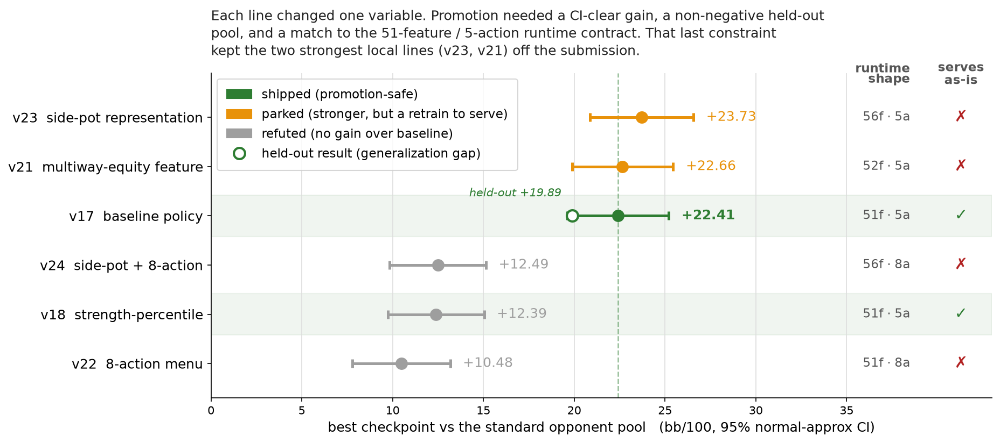

# fullhouse-bot

A 6-max no-limit Texas Hold'em bot built on Deep CFR. It qualified **12th of 500+ entrants** and
finished **15th of 64** in the international final of the
[Fullhouse Hackathon 2026](https://fullhousehackathon.com) (Quadrature Capital), inside a strict
sandbox: 2 seconds per decision, 768 MB RAM, no network, no threads, read-only filesystem.


The architecture is Deep CFR. The part worth reading is a call I made against my own benchmark: I
shipped the model that scored **+22.41 bb/100, not the one that scored +23.73**. The higher number
(v23) came from a wider feature encoding the runtime can't serve without a full retrain, and v17, the
line I shipped, was also the one that held up against opponents it never trained against (+19.89 bb/100
held-out). On a one-shot submission with no second try against the real field, the servable, general
line beats the flashy local number.

## How it works

- **Training** (offline): external-sampling MCCFR drives a dueling advantage network; traversal and
  hand evaluation are Numba-JIT compiled. No poker heuristics go into the learned policy. The net reads
  a 51-feature state and scores 5 abstract actions (`FOLD / CHECK_CALL / BET_50 / BET_POT / ALL_IN`).
- **Runtime** (in the sandbox): pure-Python NumPy inference over the weights in
  `data/deep_cfr_model.npz`, with no training-only state at decision time. The one hand-coded exception
  is short-stack preflop (≤12 bb effective), which uses a push/fold chart; every other decision on
  every street is the net.

The constraint behind every result: **training and serving share one feature encoder, one action menu,
one set of weights.** Break that contract and a checkpoint can't be served, which is why the strongest
experiments never shipped ([runtime-contract.md](docs/research/runtime-contract.md)).

## Results

Poker has no loss curve you can trust. Training error doesn't tell you whether a change made the bot
play better, so every experiment was scored the same way: change one variable, play it against a fixed
pool of opponent bots, read bb/100 with confidence intervals. Promotion required clearing a gate, not
just posting a number:

1. a CI-clear gain on the standard pool,
2. non-negative on a held-out pool the model never trained against,
3. no losing opponent segment,
4. an exact match to the 51-feature / 5-action runtime contract.



| Line | One change | Best bb/100 (95% CI) | Outcome |
|---|---|---|---|
| **v17** | 51-feature / 5-action baseline | **+22.41** `[+19.61, +25.21]` | **Shipped.** Held out at +19.89. |
| v21 | multiway-equity feature (52-dim) | +22.66 `[+19.88, +25.45]` | Parked. Runtime emits 51 features. |
| v23 | side-pot representation (56-dim) | +23.73 `[+20.88, +26.57]` | Parked. Strongest line, same mismatch. |
| v18 | strength-percentile feature | +12.39 `[+9.73, +15.04]` | Refuted. No gain over v17. |
| v22 | 8-action menu | +10.48 `[+7.78, +13.17]` | Refuted. More heads, same traversal budget. |
| v24 | side-pot + 8-action | +12.49 `[+9.84, +15.14]` | Refuted. Negative by the final checkpoint. |

These are local-harness numbers against the opponent pool in [`bots/`](bots/README.md), with 95%
normal-approximation CIs (±1.96 × stderr). They are not leaderboard results. The only external number
is the 15th-place finish. The full per-version ledger is in [experiments.md](docs/research/experiments.md).

## What I took from it

- Representation changes were the only things that beat baseline (v21, v23), and only when the runtime
  feature shape stayed byte-aligned.
- Growing the action space without growing the traversal budget just starves the new policy heads
  (v22, v24).
- The evaluator, not the model, was where most of the engineering went. A bot that beats a narrow pool
  is overfit to it, and the held-out gate is what caught that.
- The most expensive mistake was changing several structural things in one branch. Attribution
  collapses and the experiment teaches nothing.

## The sandbox

- 2 s per decision, 768 MB RAM, 30 s import warmup
- no network, subprocess, pickle, threads, processes, or writable filesystem
- Python 3.10, dependencies limited to `eval7`, `numpy`, `scipy`, `treys`, `scikit-learn`

## Repo layout

- `bot/`: the submitted runtime (feature encoder and NumPy inference)
- `training/`: Deep CFR (MCCFR traversal, replay buffers, networks, Numba game logic)
- `tooling/`: benchmark harness, leak diagnosis, and the cluster/GPU infra that ran it at scale
- `bots/`: the opponent pool every number was measured against ([details](bots/README.md))
- `engine_vendored/`: frozen snapshot of the official Fullhouse engine, for offline testing
- `docs/research/`: the [experiment ledger](docs/research/experiments.md) and the [runtime contract](docs/research/runtime-contract.md)

`main` is the shipped runtime. Every major experiment line is preserved as an `archive/*` tag
(`archive/v18` through `archive/v31-6act-6max`) so the parked and refuted branches stay inspectable.

## Run it

```bash
uv venv && source .venv/bin/activate
uv pip install -r requirements.txt

python scripts/bench.py smoke                   # fast sanity pass
python scripts/bench.py bench                    # full 6-max benchmark with CIs
python scripts/bench.py diagnose adv_random_bot  # per-opponent leak diagnosis
pytest -q                                        # CI runs ruff + pytest on every push
```

Retrain or repackage:

```bash
python -m training.train --iterations 250 --traversals 30000 --device auto
python scripts/build_submission.py               # package and validate the submission zip
```

PyTorch is intentionally unpinned in `requirements.txt`; the right wheel is platform-dependent. Install
a build separately to run training or the torch-backed tests.

## Acknowledgments

The engine, sandbox runner, and validator under `engine_vendored/` are a frozen snapshot of the
official [Fullhouse Hackathon engine](https://github.com/uzlez/fullhouse-engine) (Quadrature Capital),
kept only so the bot is testable offline. Everything else is my own work.
